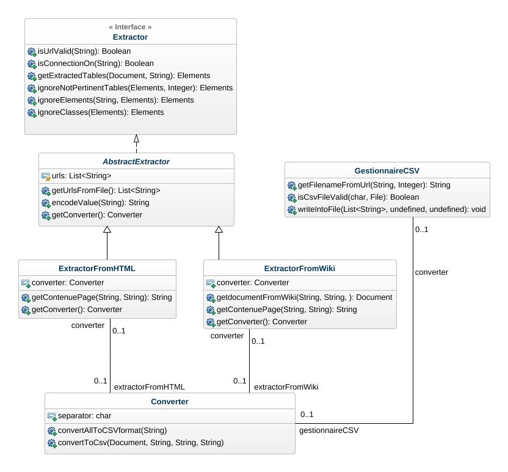

# Design.md of the PDL project

This model is intended to explain the programmatic structure of the PDL project, 
so you will find in this model the following diagrams:

## New Class diagram

Explaining the composition and structure of the classes, 
 

 

